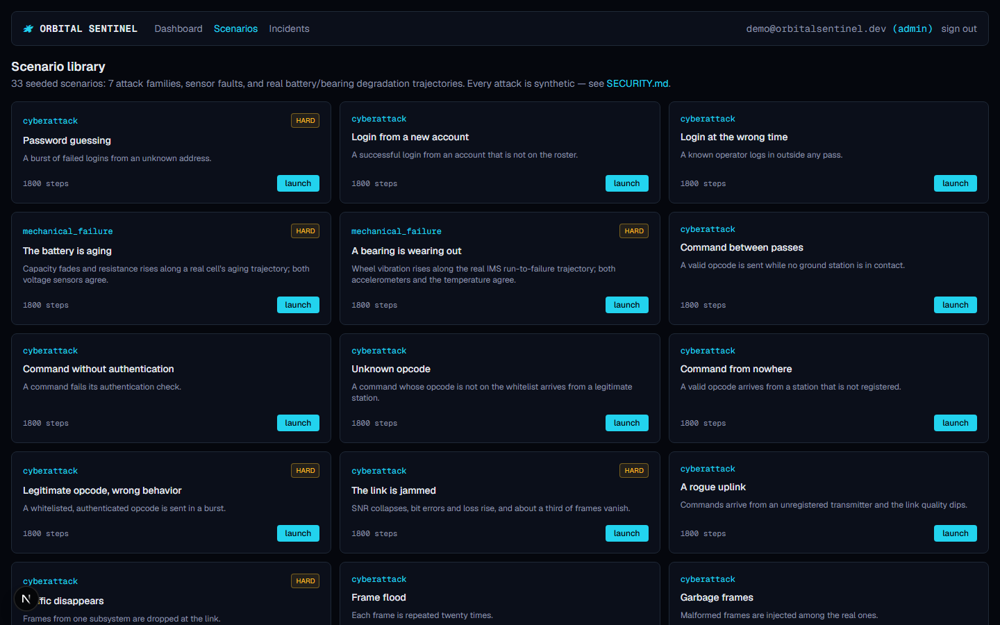
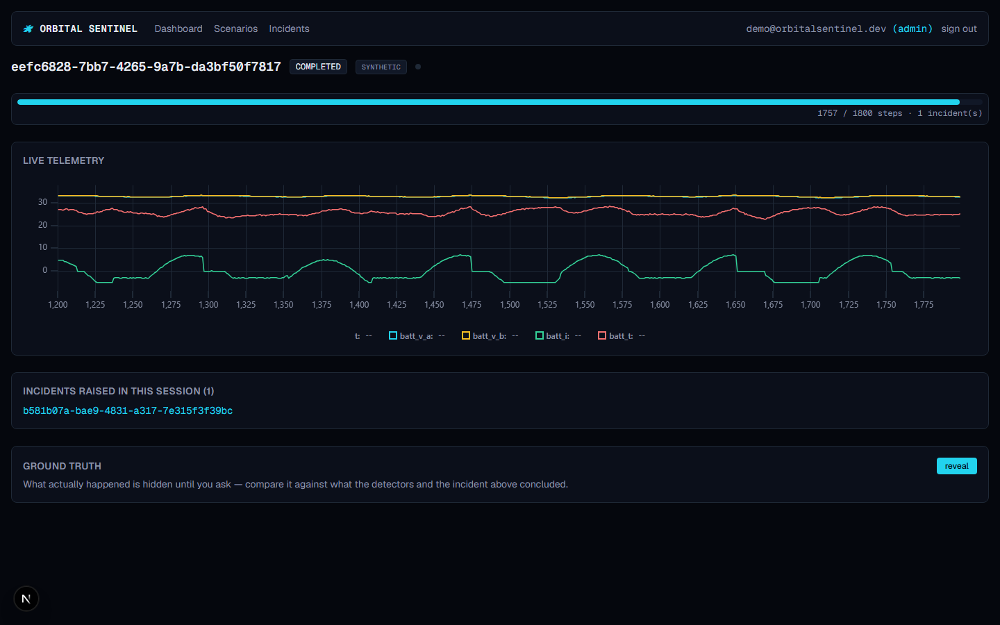
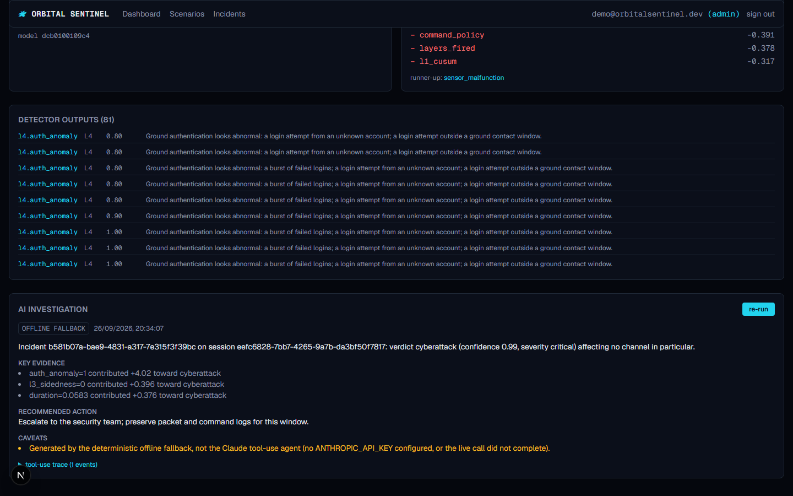
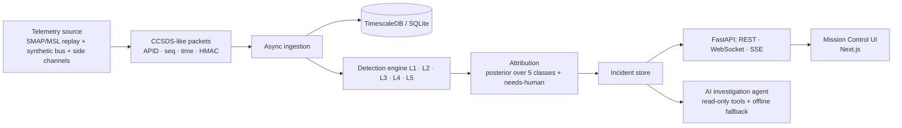

# 🛰️ ORBITAL SENTINEL

**Was that spacecraft anomaly a broken sensor, a solar storm, a failing bearing — or someone messing with it?**

[](https://github.com/Kaushik2210/ORBITAL-SENTINEL/actions/workflows/ci.yml)
[](LICENSE)


Orbital Sentinel treats a spacecraft as a distributed system. It ingests a telemetry stream, runs a layered
detection engine, and decides which of five things is going on: a **mechanical failure**, an **environmental
upset**, a **sensor malfunction**, a **cyberattack**, or **nothing at all**. When the evidence genuinely doesn't
separate the hypotheses, it says so and hands the case to a human instead of guessing.

The interesting part is the hard part: telling *confusable* cases apart.

| Looks like… | …but is actually | What separates them |
|---|---|---|
| Stale data from a stuck sensor | **Replay** attack | Sequence counters and timestamps, not the values |
| Radiation bit-flips | Injected **glitches** | Correlation with real NASA DONKI space-weather events |
| Traffic disappears | **Jamming** | Link SNR/BER versus frame rate and sequence gaps |
| One sensor slowly diverging | Sensor **spoofing** | Redundant-sensor shape... and this one is *not* solved (see below) |

> **Defensive simulation only.** No real spacecraft, ground system or third-party infrastructure is ever touched.
> All attack code operates on local synthetic or replayed data. See [`SECURITY.md`](SECURITY.md).

## Where the project stands

This is an honest snapshot. **Every planned component is built, including a one-command Docker demo.**
Details and remaining polish: [`docs/PROGRESS.md`](docs/PROGRESS.md).

| Area | State |
|---|---|
| Real NASA data acquisition, inspection and provenance ([DATASETS](docs/DATASETS.md)) | ✅ done |
| CCSDS-like packet layer with HMAC tag, async ingestion, mission replay engine | ✅ done |
| Synthetic physics bus driven by real PCoE battery / IMS bearing trajectories | ✅ done |
| Database schema, Alembic migrations, TimescaleDB hypertables (verified in CI) | ✅ done |
| Detectors: L1 statistical, L3 physics/redundancy, L4 protocol/security, L5 environment ([DETECTION](docs/DETECTION.md)) | ✅ done |
| 33-scenario library (7 attack families, faults, degradation, SEU) + explainable attribution | ✅ done |
| L2 detectors: per-channel LSTM forecaster → ONNX Runtime with dynamic thresholding, Isolation Forest baseline | ✅ done (weaker than L1 alone on real data; see results) |
| REST / WebSocket / SSE API with live scenario and real-data replay sessions ([API](docs/API.md)) | ✅ done |
| AI investigation agent: Claude tool-use loop over read-only evidence tools, offline fallback ([API](docs/API.md#ai-investigation-agent)) | ✅ done (offline path tested end-to-end; live path tested against a stub client only) |
| Platform security: JWT + roles, rate limiting, hash-chained audit log, security headers ([THREAT_MODEL](docs/THREAT_MODEL.md)) | ✅ done (single-process rate limiter/audit log — see the doc for the honest limits) |
| Mission Control web UI: live telemetry, scenario launcher, incident/evidence viewer, agent reports ([frontend](frontend/README.md)) | ✅ done (no 3D globe or animation library — scope cut to ship a working app) |
| Test suites: Vitest units, Playwright e2e against a real API, enforced backend coverage floor | ✅ done |
| Docker images and `docker compose up --build` (Postgres/TimescaleDB, API, frontend, one command) | ✅ done — **verified in CI only**, not on the machine that wrote it (no Docker installed there) |

## See it

Real screenshots of the running platform — a launched attack scenario streaming live, the incident
it raised with its exact evidence, and the AI agent's report on it. A 3-minute walkthrough script
(what to click, what to say) is in [`docs/DEMO.md`](docs/DEMO.md).

<p align="center">
  
  
  
</p>

## Results so far

All from [`docs/EVALUATION.md`](docs/EVALUATION.md), which is generated from saved run files (nothing typed by hand).
**These are simulator results on a held-out seed split, not real-spacecraft accuracy** — read
[`docs/LIMITATIONS.md`](docs/LIMITATIONS.md) alongside them.

- **Attacks are detected fast and attributed well.** Command, replay, authentication, jamming, denial-of-service and
  glitch-injection scenarios are caught within minutes (median 0-2 simulated minutes) and, with a few
  exceptions handed to a human, classified correctly; replay vs a stuck sensor, jamming vs dropout and SEU vs
  injected glitches are separated.
- **Attribution:** 86.4% accuracy when forced to choose; **95.1% on the windows it chooses to answer, at 61.8%
  coverage**. A transparent hand-written rule set scores 51.8%.
- **The hard case is not solved.** Slow, in-limits single-sensor drift (spoofing vs drift vs low-and-slow
  manipulation) cannot be separated by the current evidence. The platform abstains (`needs_human`) on
  essentially all of it rather than guessing.
- **Real data (81 labeled SMAP/MSL channels, event level):** the L1 statistical layer reaches F1 0.64 overall, but
  **0.55 on the 65 channels with a varying training signal** (the 16 constant-training channels are trivially
  perfect). The LSTM forecaster, trained for only 15 epochs, scores **0.40** on its own, well above an Isolation
  Forest baseline (0.12) but below L1; combining them is within noise (0.57). Not a clear win yet.
- **It does not generalize to failure modes it has never seen** (leave-one-scenario-out).

## Data

Real data: the NASA/JPL SMAP & MSL telemetry-anomaly set (Hundman et al., KDD 2018), NASA PCoE battery and IMS
bearing run-to-failure sets, and the NASA DONKI space-weather API. Everything else — commands, authentication
events, link metrics and **every attack** — is **synthetic and always labeled as such**. Real-data findings and
surprises (the original archive is gone, multi-hot command columns, unlabeled and duplicated channels, …) are in
[`docs/DATASETS.md`](docs/DATASETS.md). Real data is never redistributed: `make data` downloads it locally.

## Pipeline



Design: [`docs/ARCHITECTURE.md`](docs/ARCHITECTURE.md) and the decision records in [`docs/adr/`](docs/adr/).

## Try it

Requirements: Python 3.12, [`uv`](https://docs.astral.sh/uv/), Node.js 22 for the frontend. (`make` is
optional; `scripts/tasks.py` is the real runner.)

```bash
python scripts/tasks.py setup                 # install dependencies
python scripts/tasks.py data                  # real datasets into data/raw (checksummed)
python scripts/tasks.py check                 # lint + strict typing + tests
```

Reproduce the evaluation (about ten minutes):

```bash
uv sync --extra ml
uv run python -m sentinel_ml.make_dataset     # 462 scenario runs through the full engine
uv run python -m sentinel_ml.evaluate --out ml/runs/attribution-v1
uv run python -m sentinel_ml.smap_eval        # real SMAP/MSL, event level
uv run python -m sentinel_ml.render_eval --metrics ml/runs/attribution-v1/metrics.json
```

Seed a local database with a replayed mission: `python scripts/tasks.py seed`. Run the API locally with
`python scripts/tasks.py serve` (interactive docs at <http://localhost:8000/docs>). With `PUBLIC_DEMO_MODE=true`
(the default) you can browse read-only right away; to start a session, create an account first:
`USER_EMAIL=you@example.com USER_PASSWORD=... python scripts/tasks.py create-user`, then sign in.

Run [Mission Control](frontend/README.md) against it:

```bash
cd frontend && npm install && cp .env.example .env.local && npm run dev   # http://localhost:3000
```

Or skip all of the above with Docker — one command brings up Postgres/TimescaleDB, the API and the
frontend together:

```bash
cp .env.example .env   # fill in JWT_SECRET, POSTGRES_PASSWORD, ADMIN_EMAIL/ADMIN_PASSWORD
docker compose up --build   # http://localhost:3000, API at http://localhost:8000
```

## Contributing

Contributions of all sizes are welcome; please read [`CONTRIBUTING.md`](CONTRIBUTING.md). The one rule that matters
most: **no fabricated numbers** — every metric in code, docs or UI must come from a run you can reproduce.

## AI agent disclosure

`POST /incidents/{id}/investigate` uses the Anthropic API (`anthropic` SDK, `claude-sonnet-5` by default) when
`ANTHROPIC_API_KEY` is set, through a tool-use loop over eight read-only evidence tools (no tool can write or
reach the network). Without a key it runs a deterministic offline report built from the same evidence — the
default, and the only path verified end-to-end without a paid key. See
[`docs/API.md`](docs/API.md#ai-investigation-agent) and [ADR 0008](docs/adr/0008-agent-hardening.md).

## License

[MIT](LICENSE) for this project's code. Third-party datasets keep their own licenses; see
[`docs/DATASETS.md`](docs/DATASETS.md).
