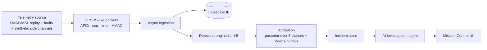

# 🛰️ ORBITAL SENTINEL

**Was that spacecraft anomaly a broken sensor, a solar storm, a failing bearing — or someone messing with it?**

Orbital Sentinel treats a spacecraft as a distributed system. It ingests a telemetry stream, runs a
five-layer detection engine, and decides which of five things is going on: a **mechanical failure**,
an **environmental upset**, a **sensor malfunction**, a **cyberattack**, or **nothing at all**. When the
evidence genuinely doesn't separate the hypotheses, it says so and hands the case to a human instead of
guessing. An AI investigation agent then writes the incident report for Mission Control.

The interesting part is the hard part: telling *confusable* cases apart.

| Looks like… | …but is actually | What separates them |
|---|---|---|
| Sensor stuck / drifting | Sensor **spoofing** | Redundant-sensor and physics cross-checks |
| Stale data | **Replay** attack | Sequence counters and timestamps vs. content |
| Radiation bit-flip | Injected **manipulation** | Correlation with real NASA DONKI space-weather events |

> **Status: early development (v0.1, bootstrap).** Nothing here is a finished feature yet. The roadmap is in
> [`docs/PROGRESS.md`](docs/PROGRESS.md). Numbers, screenshots and benchmarks will appear here only once
> they come from real runs.

> **Defensive simulation only.** No real spacecraft, ground system or third-party infrastructure is ever
> touched. All attack code operates on local synthetic or replayed data. See [`SECURITY.md`](SECURITY.md).

## Planned pipeline



## Data

Real data comes from NASA: the SMAP/MSL telemetry-anomaly set (Hundman et al., KDD 2018), the PCoE
battery and bearing run-to-failure sets, and the DONKI space-weather API. Everything else — commands,
authentication events, link metrics, and every attack — is **synthetic and always labeled as such**.
Provenance and licensing live in [`docs/DATASETS.md`](docs/DATASETS.md) (written as the data is inspected).

## Development

Requirements: Python 3.12, [`uv`](https://docs.astral.sh/uv/), Node 22+ (for the frontend, added in a later phase).

```bash
python scripts/tasks.py setup   # or: make setup
python scripts/tasks.py check   # lint + typecheck + tests
```

See [`CONTRIBUTING.md`](CONTRIBUTING.md) and [`docs/DEVELOPMENT.md`](docs/DEVELOPMENT.md).

## AI agent disclosure

The investigation agent uses the Anthropic API when `ANTHROPIC_API_KEY` is set. Without a key, a
deterministic template report is produced from the same evidence, so the project works fully offline.

## License

[MIT](LICENSE) for this project's code. Third-party datasets keep their own licenses.
