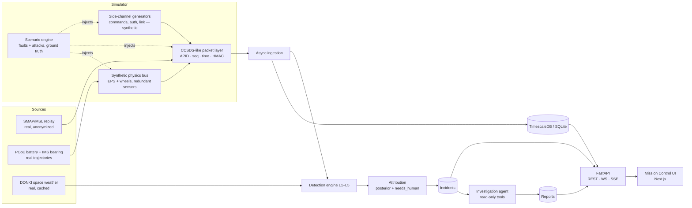
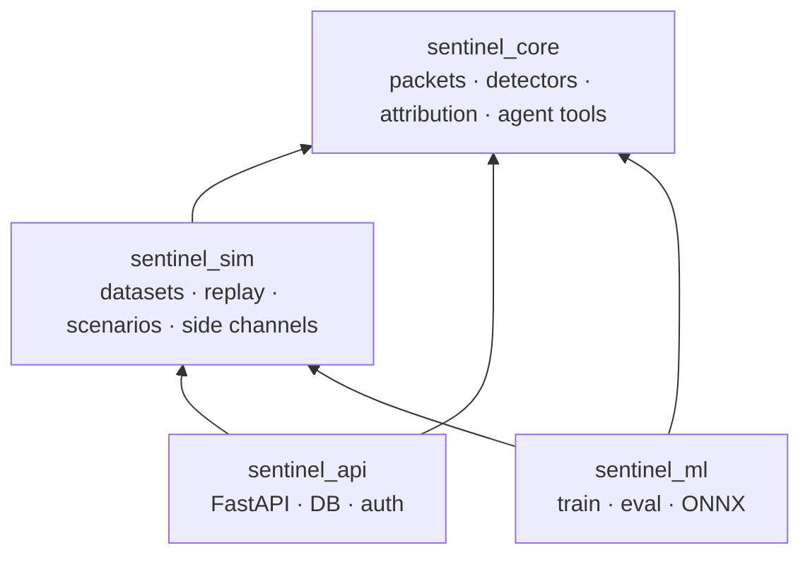
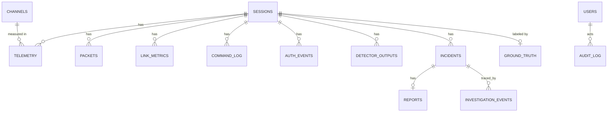

# Architecture

Status: design for Phases 3–9. Decisions that changed because of measured data are marked **[Phase 1]**
(see [`DATASETS.md`](DATASETS.md)). Design choices have ADRs in [`adr/`](adr/).

## 1. Goals and non-goals

**Goals.** Ingest a spacecraft telemetry stream, detect anomalies with layered detectors, and attribute each
incident to one of five classes (nominal, mechanical failure, environmental, sensor malfunction, cyberattack)
or to an explicit `needs_human` outcome, with reproducible, explainable evidence. Make the *confusable* pairs
the centerpiece (see §7).

**Non-goals.** No real spacecraft, ground system or third-party infrastructure is touched. Attack code runs
on local synthetic or replayed data only. This is not a flight-qualified system and not a claim about
real-mission performance.

## 2. System context



## 3. Packages and dependency direction



`sentinel_core` imports none of the others. The frontend talks only to `sentinel_api`. See ADR 0002.

## 4. Two telemetry families **[Phase 1]**

SMAP/MSL channel IDs are anonymized: there is no real redundancy, units, or physics to exploit, and the brief's
"redundant-sensor disagreement" and "power-balance sanity" checks cannot be honestly run on them. So the mission
has two families (ADR 0004):

| Family | Content | Real? | Used for |
|---|---|---|---|
| **`smap` / `msl`** | 81 labeled channels replayed from the NASA arrays (+ `T-10` unlabeled) | real | L1/L2 evaluation on real operational anomalies; live replay demo |
| **`eps` / `adcs`** (synthetic bus) | Battery/bus and reaction-wheel channels with **redundant sensors** and physical relations | synthetic *driven by real PCoE trajectories* | L3 physics checks; every scenario class; spoofing vs malfunction |

- **EPS model.** State of charge → open-circuit voltage; terminal voltage = OCV − I·R. Capacity and internal
  resistance follow the real trajectories of PCoE cells `B0005/6/7/18` (capacity per discharge cycle, `Re`/`Rct`
  from impedance cycles), time-compressed. Channels: `batt_v_a`, `batt_v_b` (redundant sensors), `batt_i`,
  `batt_t`, `bus_v`, `solar_i`, `load_i`. Relation: `solar_i − load_i ≈ batt_i`.
- **Wheel model.** Vibration RMS/kurtosis per snapshot from IMS test 2 (real; bearing 1 fails) drive
  `rw1_vib_a/b` (two accelerometers) and `rw2_vib`; `rw*_speed`, `rw*_temp` are synthetic and coupled.
- Every synthetic channel has `synthetic = true` in DB, API and UI, and a badge in the UI.
- If PCoE/IMS data is unavailable, the trajectories come from a documented parametric aging model, still
  labeled synthetic (fallback, ADR 0003).
- SMAP/MSL channels are grouped into "subsystems" by ID-prefix letter *only for display*; that grouping is a
  **synthetic grouping** and is badged as such.

## 5. Packet layer (CCSDS-like)

Modeled on the CCSDS Space Packet Protocol (CCSDS 133.0-B) primary header, plus a timestamp and an
authentication tag. It is **not** SDLS; the tag is a simulation of link authentication (ADR 0005).

| Field | Bits | Notes |
|---|---|---|
| Version | 3 | 0 |
| Type | 1 | 0 = telemetry, 1 = telecommand |
| Secondary header flag | 1 | always 1 |
| APID | 11 | one per subsystem group, from the mission database |
| Sequence flags | 2 | `0b11` = unsegmented |
| **Sequence count** | 14 | wraps at 16,384; detectors must handle the wrap |
| Data length | 16 | octets after the primary header − 1 |
| Timestamp (secondary hdr) | 64 | uint32 seconds + uint32 microseconds, mission epoch |
| Payload | n × 32 | float32 samples in APID channel order (TM) or opcode+args+source (TC) |
| Auth tag | 128 | HMAC-SHA256 truncated to 16 bytes over header+timestamp+payload |

- The HMAC key is synthetic (`FRAME_HMAC_KEY`). Comparison uses `hmac.compare_digest`.
- Scenarios declare `attacker_has_key`. Without the key, tampering breaks the tag (L4 sees it). With the key,
  manipulation is *authentic on the wire* and only L1–L3 can catch it. This is what makes cases genuinely hard.
- Replayed frames keep a **valid** tag (they are real old frames): auth checks cannot catch replay; sequence
  regression and stale timestamps can.

## 6. Detection engine

### 6.1 Interface

```python
class EventKind(StrEnum): TELEMETRY, PACKET, COMMAND, AUTH, LINK, SPACE_WEATHER

class Detector(Protocol):
    name: str
    layer: Layer                       # L1..L5
    consumes: frozenset[EventKind]
    def update(self, event: Event) -> list[DetectorOutput]: ...
    def reset(self) -> None: ...

class DetectorOutput(BaseModel):
    detector: str; layer: Layer; ts: float; channel: str | None
    score: float          # 0..1, monotone in evidence strength
    fired: bool           # score >= detector threshold
    evidence: list[Evidence]     # name, observed, expected, unit, note
    explanation: str             # one sentence, deterministic template
```

Detectors are **streaming and stateful** (per channel), deterministic given a seed and input order, and never see
ground truth. The engine fans events to detectors by `consumes`.

### 6.2 Layers

| Layer | Detectors | Handles **[Phase 1]** findings |
|---|---|---|
| **L1 statistical** | range/limit, EWMA z-score, CUSUM, rate-of-change | Limits are learned from train *and* widened by a margin, because test data leaves the train range on 43/82 channels. Constant-train channels (16) get a variance floor and a "flatline" check instead of a z-score. |
| **L2 ML** | Telemanom-style LSTM forecaster + EWMA residual smoothing + non-parametric dynamic threshold + pruning; Isolation Forest baseline | Command columns are **multi-hot**, so they are fed as a binary vector, not one-hot. Forecaster served via ONNX Runtime. Channel `M-6` (test max 258) needs robust scaling. |
| **L3 cross-channel / physics** | redundant-sensor disagreement (`batt_v_a` vs `batt_v_b`), power-balance residual, correlated-channel checks | Runs on the synthetic bus only (§4). Emits *shape* features (step vs ramp vs noise change), not just "disagree". |
| **L4 protocol / security** | sequence gap/duplicate/regression (with 14-bit wrap), stale timestamp, HMAC failure, command whitelist/rate/source/contact-window, failed-auth bursts / new source / off-window, SNR/BER/latency shift, packet-rate flood + queue depth | Independent of value semantics, so works on every family. |
| **L5 environmental** | overlap of anomaly window with DONKI events (FLR/CME/GST/SEP/IPS), simultaneous multi-channel single-event-upset pattern | Uses cached DONKI only; degrades to "no context" (not "no event") when the cache lacks the window. |

### 6.3 Incident builder

Detector outputs that fire are grouped into an **incident**: opens on the first fired output, extends while any
detector keeps firing (hysteresis: closes after `quiet_steps` without a fire), and is re-attributed as evidence
arrives and once more on close. Windows, affected channels and per-detector aggregates are stored so any
decision can be recomputed offline.

## 7. Attribution and the confusable pairs

**Model (ADR 0006).** Multinomial logistic regression over ≈30 evidence features per incident window (max/mean
score per detector, number and simultaneity of affected channels, auth/sequence/HMAC flags, link shift, DONKI
overlap and magnitude, redundancy-disagreement shape, physics residual, flatline/dropout/noise-ratio/drift
slope, …), trained on seeded simulated scenarios, temperature-scaled on a validation split.

- **Exact explanations.** `logit_k = b_k + Σ_j w_kj x_j`; the per-feature term `w_kj x_j` is the exact
  contribution, so "top evidence for/against each class" is not an approximation.
- **`needs_human`.** Returned when `p_top < τ` or `p_top − p_second < δ`; `τ, δ` are tuned on the validation
  split and reported as a risk–coverage curve.
- **Reproducibility.** The feature vector, model version and posterior are stored with the incident; recomputing
  from stored evidence must give an identical posterior (tested).
- **Limitation (stated up front).** Train and test scenarios come from the same simulator. Results measure
  separability *within* that simulator, not real-world accuracy.

| Confusable pair | Looks alike because | Separating evidence |
|---|---|---|
| **Sensor spoofing ↔ sensor malfunction/drift** | one redundant sensor diverges, values plausible | disagreement *shape* and noise level (attacker-synthesized values are too clean/step-like), coupling to temperature and command activity, authentic frames, cross-sensor physics |
| **Replay ↔ stale data (stuck sensor)** | values repeat | replay: sequence regression + stale timestamps + *valid* tag; stuck sensor: normal sequence, fresh time, flat value |
| **SEU ↔ injected manipulation** | abrupt value jumps | SEU: random-bit magnitudes, multiple unrelated channels at once, valid tag, inside a DONKI SEP/flare window; manipulation: structured offsets, off-window, possible tag failure |
| **Battery degradation ↔ sensor drift** | slow drift | real degradation shows in *both* redundant sensors and satisfies current-integration; sensor drift is one-sided and violates it |
| **DoS ↔ jamming ↔ dropout** | data stops arriving | flood: rate↑ + queue↑; jamming: SNR↓ BER↑; dropout: one channel absent, link healthy |
| **Command injection ↔ rare legitimate command** | whitelisted opcode | source, contact window, rate, sequence-of-commands context |
| **Brute force ↔ operator typo** | failed logins | burst rate, distinct sources, off-window |

## 8. Scenario engine

YAML-defined, seeded, ground-truth labeled. Schema (draft):

```yaml
id: spoof_slow_bias_battv
class: cyberattack            # nominal|mechanical_failure|environmental|sensor_malfunction|cyberattack
subtype: sensor_spoofing
family: eps
seed: 4101
steps: 2400
warmup_steps: 600
attacker: {has_key: true, position: sensor}    # sensor | link | ground
events:
  - {type: ramp, target: batt_v_a, start: 1200, end: 1900, magnitude: 0.08, within_limits: true}
ground_truth:
  affected_channels: [batt_v_a]
  tags: {sparta: [...], attack: [...]}
confusable_with: [sensor_drift_battv]
```

Ground truth is stored in its own table and is never visible to detectors. It is exposed only to the evaluator,
the Attack Simulator (comparison view) and the "Attack or Accident?" challenge after the user commits a guess.
Each scenario records class, subtype, start/end, affected channels, and SPARTA/ATT&CK tags. Fault injection is
applied at the right layer: **sensor** faults before packetization, **link** attacks on frames (tag and sequence
implications), **ground** attacks in the command/auth logs.

## 9. Data model



| Table | Key columns | Notes |
|---|---|---|
| `sessions` | id, kind (`replay`/`scenario`), scenario_id, seed, speed, started_at, `synthetic` | one run of the mission |
| `channels` | id, family, subsystem_group, unit, source (`smap`,`msl`,`synthetic`), `synthetic` | display grouping flagged synthetic |
| `telemetry` | (session_id, channel_id, ts) PK, value | **hypertable** on ts. No injection flag: ground truth is separate |
| `packets` | session_id, ts_rx, apid, seq_count, ts_pkt, kind, auth_ok, source, `synthetic` | **hypertable** |
| `link_metrics` | session_id, ts, snr_db, ber, latency_ms, loss_pct, rx_pps, queue_depth, `synthetic` | **hypertable** |
| `command_log`, `auth_events` | session_id, ts, opcode/outcome, source, in_window, `synthetic` | |
| `detector_outputs` | session_id, ts, detector, layer, channel_id, score, fired, evidence_json | **hypertable** |
| `incidents` | id, session_id, opened_at, closed_at, status, verdict, confidence, posterior_json, features_json, model_version | features stored for reproducibility |
| `ground_truth` | session_id, class, subtype, start_ts, end_ts, channels_json, tags_json | evaluator/simulator only |
| `reports`, `investigation_events` | incident_id, mode (`llm`/`offline`), report_json, markdown / seq, kind, payload_json | trace replayed by SSE |
| `donki_events` | id, kind, event_time, class/kp, raw_json, fetched_at | cache of the live API |
| `eval_runs` | id, kind, git_sha, seed, profile, metrics_json | every displayed metric points to one |
| `users`, `audit_log` | role; append-only, hash-chained (`prev_hash`, `hash`) | Postgres: `UPDATE/DELETE` revoked + trigger |

**Timescale (ADR 0007).** Hypertables on `telemetry`, `packets`, `link_metrics`, `detector_outputs` (1-day chunks),
compression after 7 days, 30-day retention for demo data. These policies exist only in Alembic migrations guarded
by `dialect == postgresql`; SQLite (local default) uses plain tables. Timescale behavior is verified only in CI
(`postgres` marker) because Docker is not available on the dev machine.

## 10. API contract (draft)

REST under `/api/v1`, JSON, cursor pagination (`?limit=&cursor=`), Pydantic v2 models, OpenAPI at `/docs`.

| Method | Path | Role | Purpose |
|---|---|---|---|
| POST | `/auth/login` | – | JWT for seeded demo users |
| GET | `/channels`, `/channels/{id}` | viewer | catalog (`synthetic` flag) |
| GET | `/sessions`, `/sessions/{id}` | viewer | runs |
| POST | `/sessions` | analyst | start replay or scenario |
| POST | `/sessions/{id}/control` | analyst | `play`/`pause`/`seek`/`speed` |
| GET | `/sessions/{id}/telemetry` | viewer | windowed history (downsampled) |
| GET | `/incidents`, `/incidents/{id}` | viewer | filter by class/severity/confidence/status |
| GET | `/incidents/{id}/evidence` | viewer | detector outputs + feature contributions |
| POST | `/incidents/{id}/investigate` | analyst | start agent investigation |
| GET | `/incidents/{id}/report` (`.md`/`.pdf`) | viewer | final report + export |
| GET | `/scenarios`, POST `/scenarios/{id}/run` | analyst | Attack Simulator |
| GET | `/evaluation/runs`, `/evaluation/runs/{id}` | viewer | real eval metrics |
| GET | `/datasets/channels`, `/datasets/anomalies`, `/datasets/donki` | viewer | Dataset Explorer |
| GET | `/health`, `/ready` | – | probes |

**Streaming.** `WS /ws/sessions/{id}` sends `{type:"samples", ts, values}` and `{type:"detection", ...}` batches
(≤ 20 Hz, decimated) and accepts no commands (control is REST, so it is auditable). `SSE /sse/incidents` streams
new/updated incidents. `SSE /sse/incidents/{id}/investigation` streams trace events:
`tool_call` → `tool_result` → … → `final`.

## 11. Investigation agent

Anthropic SDK tool-use loop (model from `ANTHROPIC_MODEL`). Tools are **read-only**: `query_telemetry`,
`get_detector_outputs`, `get_packet_integrity`, `get_command_and_auth_log`, `get_link_metrics`,
`get_space_weather_context`, `compare_to_baseline`, `map_to_sparta_attack`. Output is a Pydantic-validated
incident report (summary, classification + confidence, evidence table, timeline, affected channels, hypotheses
considered/rejected, SPARTA/ATT&CK mapping, recommended actions, caveats). Hardening (ADR 0008): telemetry-derived
strings are delivered as JSON *data* fields inside a delimited block, never concatenated into instructions;
tools cannot write; output schema is validated and retried once; a test feeds an auth-log entry that tries to
instruct the agent. Without an API key a deterministic template report is produced from the same evidence.

## 12. Frontend

Next.js App Router, strict TypeScript. Routes: `/` (landing), `/mission`, `/telemetry`, `/incidents`,
`/incidents/[id]`, `/simulator`, `/performance`, `/datasets`. **Server data** uses TanStack Query; **live data**
(WS) lands in fixed-size ring buffers (typed arrays) in a Zustand store and is drawn by uPlot outside React's
render path to hold 60 fps; the 3D globe (react-three-fiber) is lazy-loaded so it never blocks the landing
page's Lighthouse budget. Every page has loading/empty/error states; motion respects `prefers-reduced-motion`.

## 13. Security of the platform itself

JWT + roles (viewer/analyst/admin), optional public read-only demo mode, rate limiting, CORS allowlist, CSP and
security headers, append-only hash-chained audit log, HMAC-signed simulated commands, dependency/container
scanning in CI. Threat model (STRIDE) in `THREAT_MODEL.md` (Phase 9).

## 14. Runtime matrix (what is verified where)

| Concern | Local (this dev machine) | CI (GitHub Actions) |
|---|---|---|
| Python lint/types/tests | ✅ | ✅ |
| DB | SQLite | SQLite + Postgres/TimescaleDB service |
| Timescale hypertables/policies | ❌ not verifiable | ✅ |
| Docker images / compose | ❌ Docker not installed | ✅ build + healthcheck |
| Frontend unit/e2e | ✅ Playwright | ✅ |
| Live LLM agent | only with a key | only with a secret; offline path always |

## 15. ADR index

1 Record decisions · 2 Package layout · 3 Dataset chain and labeled fallbacks · 4 Two telemetry families ·
5 Packet layer and authentication tag · 6 Attribution model · 7 Database portability · 8 Agent hardening ·
9 Live transport (WS + SSE).
